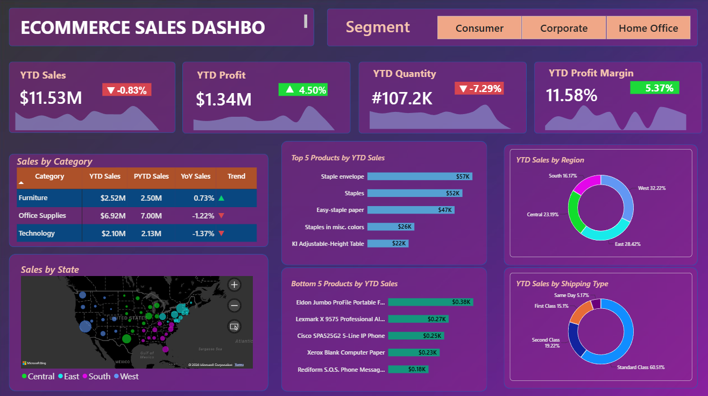
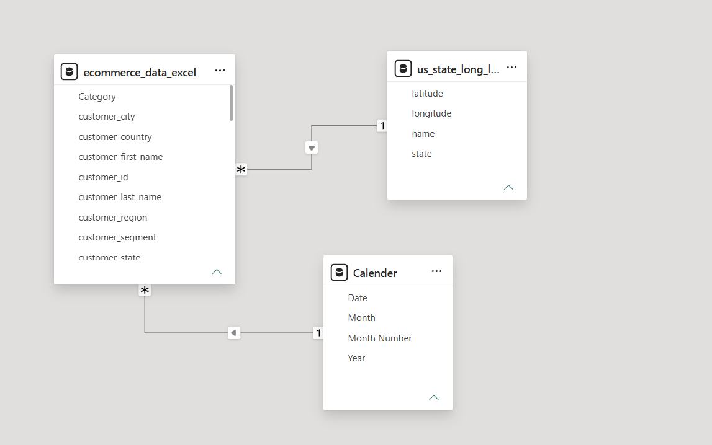
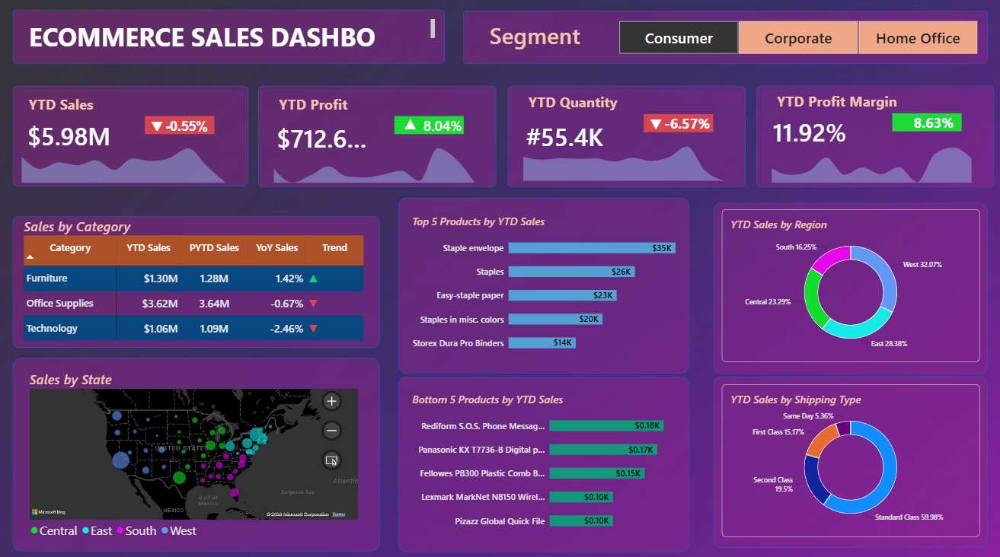
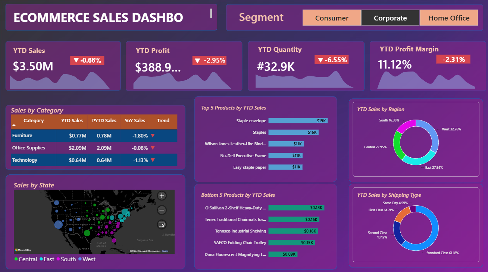

# 📊 E-Commerce Sales Performance Dashboard | Excel & Power BI

## 📌 Overview

The **E-Commerce Sales Performance Dashboard** is an interactive Business Intelligence solution built using **Microsoft Excel** and **Power BI**. The project transforms raw e-commerce sales data into meaningful business insights through data modeling, DAX calculations, Time Intelligence, and interactive visualizations.

The dashboard enables users to monitor sales performance, profitability, product trends, regional distribution, and customer segments through an intuitive and interactive reporting experience.

---

## 🎯 Business Problem

Organizations generate large volumes of transactional sales data every day. Analyzing raw data manually makes it difficult to identify sales trends, evaluate profitability, monitor product performance, and support business decision-making.

This dashboard addresses these challenges by converting raw sales data into interactive visual reports that enable faster and data-driven business decisions.

---

## 🚀 Project Objectives

- Monitor Year-to-Date (YTD) Sales, Profit, Quantity, and Profit Margin.
- Compare current performance with Previous Year-to-Date (PYTD).
- Perform Year-over-Year (YoY) analysis.
- Identify Top 5 and Bottom 5 performing products.
- Analyze sales across categories, regions, and shipping methods.
- Visualize geographical sales distribution.
- Enable interactive dashboard filtering using customer segments.

---

## 🛠️ Tech Stack

| Tool | Purpose |
|------|---------|
| Microsoft Excel | Source Data |
| Power BI Desktop | Dashboard Development |
| Power Query | Data Preparation |
| DAX | KPI & Time Intelligence Calculations |

---

## 📂 Dataset

This project uses two datasets:

| Dataset | Description |
|----------|-------------|
| **ecommerce-sales-data.csv** | Transactional e-commerce sales data |
| **us-state-coordinates.csv** | State latitude & longitude lookup table used for map visualization |

---

## 🏗️ Data Model

The dashboard follows a **Star Schema** consisting of:

### Fact Table

- `ecommerce_sales_data`

### Dimension Tables

- `Calendar`
- `us_state_coordinates`

The Calendar table supports Time Intelligence calculations, while the geographical lookup table enables state-level mapping.

### Data Model

---

## 📊 Dashboard Features

The dashboard includes:

- Dynamic KPI Cards
- Customer Segment Slicer
- Sales by Category
- Top 5 Products by YTD Sales
- Bottom 5 Products by YTD Sales
- Sales by Region
- Sales by Shipping Type
- Sales by State (Map)
- Dynamic Trend Indicators
- Conditional Formatting
- Interactive Cross Filtering

---

## 📈 DAX & Time Intelligence

The dashboard implements DAX measures for:

- Year-to-Date (YTD) Sales
- Year-to-Date (YTD) Profit
- Year-to-Date (YTD) Quantity
- Previous Year-to-Date (PYTD) Sales
- Previous Year-to-Date (PYTD) Profit
- Previous Year-to-Date (PYTD) Quantity
- Year-over-Year (YoY) Sales
- Year-over-Year (YoY) Profit
- Year-over-Year (YoY) Quantity
- Profit Margin
- Dynamic KPI Indicators
- Trend Analysis
- Dynamic Icons
- Conditional Formatting

---

## 📷 Dashboard Preview

### Default Dashboard

The default dashboard provides an overview of business performance across sales, profit, quantity, product performance, regional distribution, and shipping analysis.

---

### Interactive Filtering – Consumer Segment

This view shows how the dashboard responds dynamically when the **Consumer** customer segment is selected, updating KPIs and all connected visuals in real time.

---

### Interactive Filtering – Corporate Segment

This view highlights the **Corporate** customer segment and demonstrates interactive filtering through Power BI slicers and dynamic visual updates.

---

## 💡 Business Insights

The dashboard enables business users to:

- Monitor overall sales performance using Year-to-Date metrics.
- Compare current business performance with the previous year.
- Identify top-performing and underperforming products.
- Analyze category-wise sales contribution.
- Evaluate regional sales distribution.
- Compare shipping method performance.
- Visualize geographical sales distribution across U.S. states.
- Explore sales interactively using customer segment filters.

---

## 💼 Skills Demonstrated

- Data Visualization
- Business Intelligence
- Dashboard Design
- Data Modeling
- Star Schema
- Power Query
- DAX
- Time Intelligence
- KPI Development
- Interactive Reporting
- Business Analysis
- Microsoft Excel
- Power BI

---

## 📋 Requirements

To view this project, you will need:

- Microsoft Power BI Desktop
- Microsoft Excel (optional, for viewing the datasets)

---

## ▶️ How to Run

1. Clone or download this repository.
2. Open **E-Commerce Sales Performance Dashboard.pbix** using Microsoft Power BI Desktop.
3. Refresh the data if prompted.
4. Use the Customer Segment slicer to explore the dashboard interactively.

---

## 🔮 Future Improvements

- Drill-through report pages
- Tooltip pages
- Forecasting and trend prediction
- Additional customer-level analytics
- Enhanced KPI scorecards

---

## 👤 Author

**Bhavani Bagali**

Aspiring Data Analyst skilled in **Excel, SQL, Python, and Power BI**, with a strong interest in Business Intelligence, Data Visualization, and solving real-world business problems through data.
